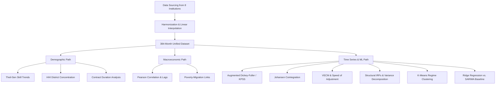

# The Remittance Blueprint: Data-driven Intelligence for Sri Lanka

[](https://www.python.org/)
[](https://opensource.org/licenses/MIT)
[](https://jupyter.org/)

This repository contains the dataset, analytical code, and research findings for **"The Remittance Blueprint: Data-driven Intelligence for Sri Lanka"**, a comprehensive study analyzing 32 years (1994–2025) of Sri Lankan labor emigration and worker remittances. The study leverages a 384-month harmonized dataset, employing exploratory data analysis, stationarity-corrected econometric modeling (ADF, Johansen Cointegration, VECM), and supervised machine learning (Ridge Regression) to analyze and forecast remittance inflows.

---

## 📄 Abstract & Executive Summary

Worker remittances consistently account for **6–9% of Sri Lanka's GDP**, serving as a critical buffer for foreign exchange reserves and debt sustainability. This study addresses key gaps in existing research by developing a unified **32-year, 384-month harmonized dataset** from eight authoritative sources.

Our empirical findings reveal that remittance inflows are primarily driven by **external macroeconomic variables** (specifically exchange rate dynamics and global oil prices) rather than domestic economic indicators:
- **Vector Error Correction Model (VECM)**: Confirms a stable long-run equilibrium. The system exhibits a speed-of-adjustment of $\alpha \approx -0.15$, correcting roughly 15% of disequilibrium monthly and returning to stability in **~6.7 months**.
- **Impulse Response Functions (IRFs)**: Reveal that LKR currency depreciation shocks trigger an immediate short-term (1–3 months) contraction in official inflows due to capital diversion into informal parallel networks (Hawala/Undiyal), before recovering by month 6.
- **Predictive Modeling**: Multivariate machine learning models significantly outperform univariate baselines. **Ridge Regression** achieves a **73.8% accuracy improvement** over SARIMA, reducing testing RMSE from USD 1,889 Million to **USD 494.8 Million**.
- **2026 Forecast**: Under stable conditions, the optimized framework projects a 2026 remittance inflow of **USD 9,001 Million** (± USD 970 Million at 95% confidence).

---

## 👥 Contributors

* **Dhinanjaya Fernando** 
* **Dinura Ginige** 
* **Kalana Lakshan** 
* **Chanupa Gurusinghe**
* **Lasana Pahanga** 
* **Subavarshana Arumugam** 
* **Sandeepa Weerasekara** 
* **Sandareka Wickramanayake** 
* **Nisansa de Silva** 


*University of Moratuwa, Department of Computer Science & Engineering*

---

## 📈 Key Empirical Insights

### 1. Demographic Shift and Skill Polarization
- **Gender Transition**: Sri Lankan migration has transitioned from a highly feminized flow in the mid-1990s (1994: 72.8% female, mostly low-skilled domestic workers) to a male-dominated flow stabilizing around a **60:40 male-to-female ratio** post-2008.
- **Contract Duration Length**: Average contract duration nearly doubled from **1.8 years** (1994) to **3.5 years** (2025). This shows an extremely high correlation with the LKR/USD exchange rate ($r = 0.951$), suggesting that currency depreciation acts as a strong economic constraint pushing workers into longer overseas commitments.
- **Geographic Concentration**: Emigration pre-departure networks have increasingly concentrated in the Kurunegala district ($HHI$ rising by +9.00/year), bypassing other districts and highlighting spatial inequalities in migration access.

### 2. Macroeconomic Transmission Channels
- **Oil Price Dependency**: Emigration is strongly correlated with Brent crude oil prices ($r = 0.707, p < 0.001$), acting as a proxy for Gulf Cooperation Council (GCC) economic activity and hiring capacity. This creates a pro-cyclical vulnerability for Sri Lankan labor export.
- **Remittances and Exchange Rate**: An income and valuation effect operates in tandem: depreciating exchange rates encourage more remittances ($r = 0.665$), but sudden domestic devaluations trigger short-term official remittance contraction as funds divert to parallel markets.

### 3. Quantitative Summary Table
The table below displays the key Pearson correlation coefficients ($r$) from the 32-year historical analysis:

| Variable Pair | Coefficient ($r$) | Significance | Direction & Interpretation |
| :--- | :---: | :---: | :--- |
| **Emigration ↔ Oil Price** | `+0.707` | \*\*\* | Higher Gulf oil wealth drives demand for Sri Lankan labor. |
| **Contract Duration ↔ Dollar Rate** | `+0.951` | \*\*\* | Rupee weakness strongly drives longer contract commitments. |
| **Remittances ↔ Dollar Rate** | `+0.665` | \*\*\* | Long-term rupee depreciation is associated with higher remittances. |
| **Remittances ↔ Oil Price** | `+0.626` | \*\*\* | Gulf economic health directly influences remittance inflows. |
| **Average Age ↔ Remittances** | `+0.847` | \*\*\* | Older/experienced cohorts generate higher remittance yields. |
| **Male Emigration % ↔ Dollar Rate** | `+0.819` | \*\*\* | Rupee weakness accelerates skilled male emigration. |
| **Female Emigration % ↔ Dollar Rate**| `-0.687` | \*\*\* | Rupee weakness is associated with declining shares of female migration. |

*Significance level: \*\*\* $p < 0.001$*

---

## 📂 Repository Structure

The codebase is organized into modular paths covering data processing, descriptive analysis, and econometric/machine learning modeling:

```text
├── Dataset_Management/
│   ├── SriLanka_Migration_final.csv       # Harmonized 32-year monthly dataset (384 rows)
│   └── dataframe_Extract.py               # Data prep, interpolation, and percentage calculations
│
├── Analysis/
│   ├── Dhinanjaya/
│   │   ├── migration_remittance_analysis.ipynb  # Primary econometric & ML forecasting pipeline
│   │   ├── SriLanka_Migration_final.csv         # Local dataset copy
│   │   └── fig*.png                             # Statistical and model evaluation plots
│   │
│   ├── Lasana/
│   │   ├── descriptive_analysis.ipynb          # Descriptive metrics, distributions, and outliers
│   │   ├── eda_analysis.ipynb                  # Pairwise correlations, heatmaps, lag analysis
│   │   ├── descriptive_findings.txt            # Documented qualitative findings (descriptive)
│   │   ├── eda_findings.txt                    # Documented correlation metrics
│   │   └── desc_*.png, eda_*.png               # EDA visual outputs
│   │
│   ├── Chanupa/                                # Subfolders containing:
│   │   └── EDA_3, EDA_4, Hypothesis_2, 4       # Specific EDA routines & Hypothesis test notebooks
│   │
│   ├── Dinura/                                 # Subfolders containing:
│   │   └── EDA1, EDA2, Hypothesis1, 3          # Baseline EDA & Hypothesis test notebooks
│   │
│   └── Kalana/
│       ├── SriLanka_Migration_final.csv
│       ├── charts/                             # Visualizations repository
│       └── final_column_analysis/              # Domain-specific feature analysis
│
└── README.md                                  # Project overview and reproduction guide
```

---

## 🛠️ Installation & Setup

1. **Clone the Repository**
   ```bash
   git clone https://github.com/Dinurang/SriLanka-Remittance-DS-Project.git
   cd SriLanka-Remittance-DS-Project
   ```

2. **Set Up a Virtual Environment (Recommended)**
   ```bash
   python -m venv venv
   # On Windows:
   venv\Scripts\activate
   # On macOS/Linux:
   source venv/bin/activate
   ```

3. **Install Dependencies**
   Ensure you have the required analytical libraries installed:
   ```bash
   pip install pandas numpy matplotlib seaborn statsmodels scikit-learn scipy jupyter
   ```

---

## Running the Code

### 1. Data Cleaning & Extraction
The main harmonized file is located in `Dataset_Management/SriLanka_Migration_final.csv`. If you wish to re-run the extraction script that prepares annual subsets and calculate migration ratios:
```bash
cd Dataset_Management
python dataframe_Extract.py
```

### 2. Exploratory Data Analysis (EDA)
Open the Jupyter Notebooks under `Analysis/Lasana/` or target directories in `Dinura/` and `Chanupa/` to reproduce the descriptive analysis, correlation matrices, and gender distribution plots:
```bash
jupyter notebook Analysis/Lasana/eda_analysis.ipynb
```

### 3. Advanced Econometrics & Ridge Forecasting
To run the full modeling pipeline, including VECM, Cointegration testing, IRF shocks, K-Means clustering, and the predictive Ridge Regression model:
```bash
jupyter notebook Analysis/Dhinanjaya/migration_remittance_analysis.ipynb
```

---

## 📊 Analytical Pipeline & Methods



### Econometric Specifications
- **Stationarity**: All primary series are non-stationary in levels but stationary upon first-differencing, verifying they are integrated of order one $I(1)$.
- **Vector Error Correction Model (VECM)**:
  $$\Delta Y_t = \Pi Y_{t-1} + \sum_{i=1}^{k-1} \Gamma_i \Delta Y_{t-i} + \epsilon_t$$
  Where $\Pi$ represents long-run cointegrated relationships, and $\Gamma_i$ represents short-run dynamics.
- **Ridge Regression**: Fitted using L2 regularization to penalize collinear variables and prevent overfitting, capturing temporal autoregressive momentum via engineered historical lags (Lag-1 and Lag-12).


### Citations
