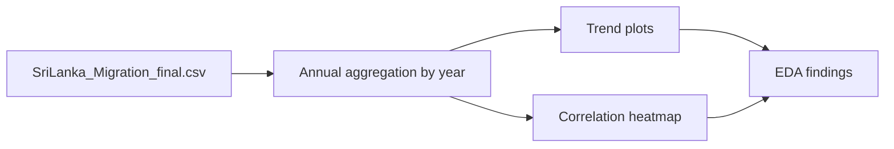
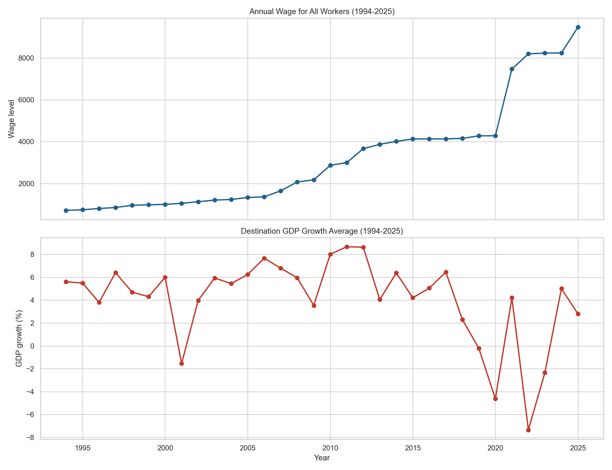
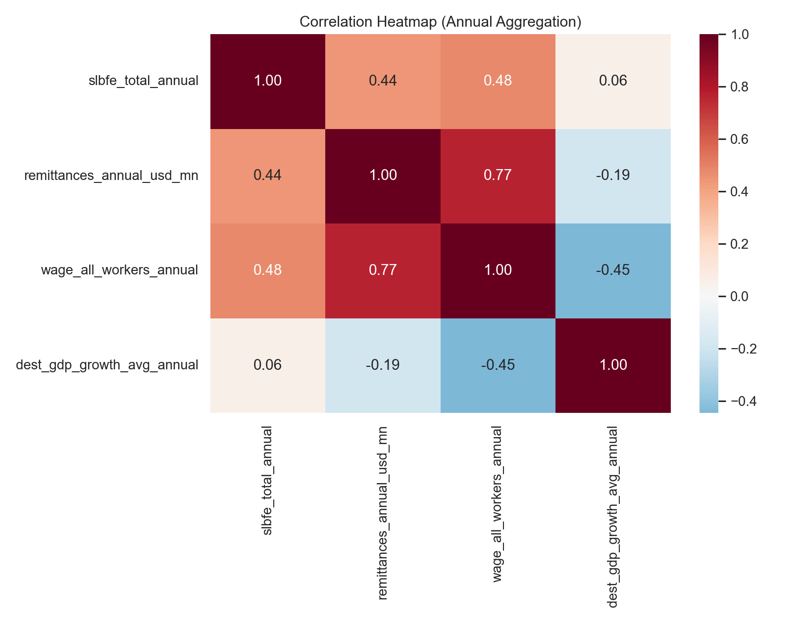
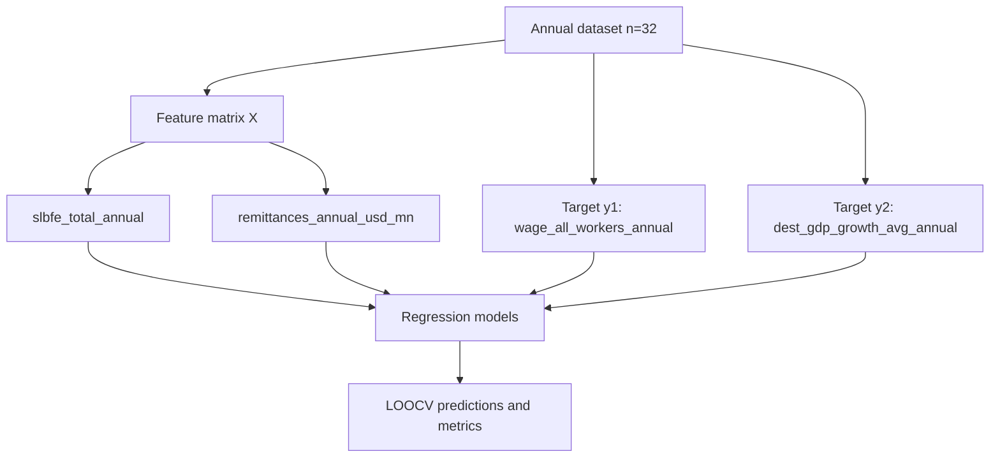
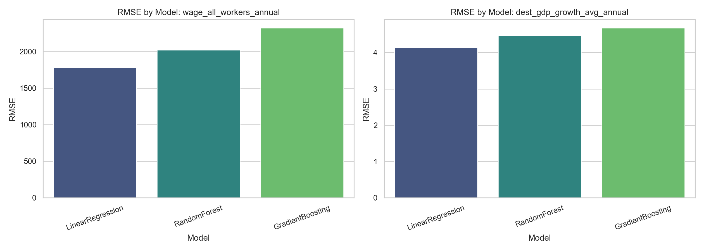
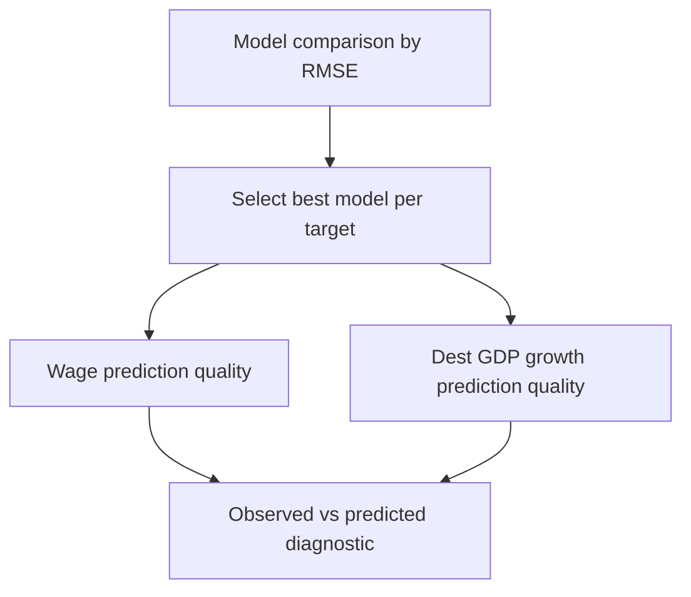
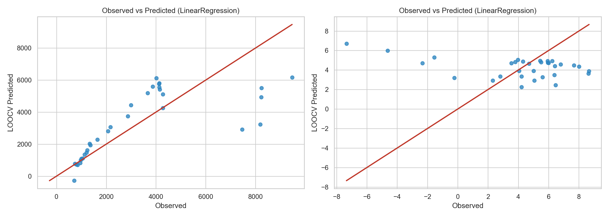
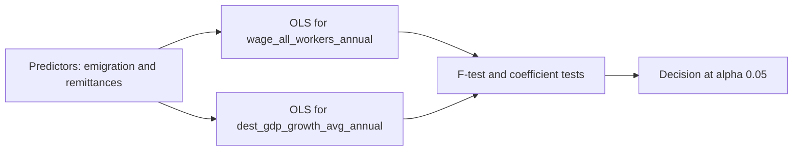
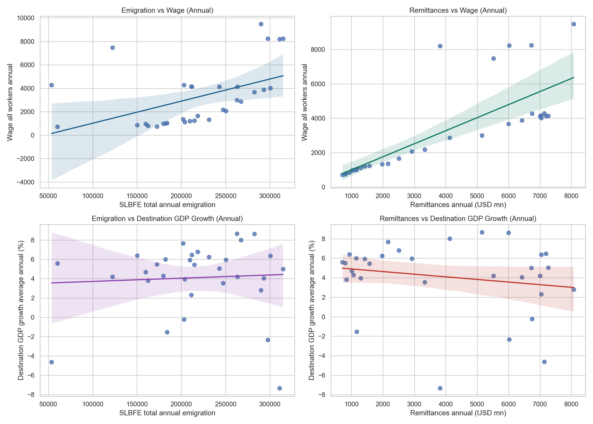

# Combined Predictive Analysis: Emigration, Remittances, Wages, and Destination GDP Growth (1994-2025)

This folder contains one combined, reproducible analysis built from:

- `SriLanka_Migration_final.csv`
- Context checks from `final_column_analysis/wage_all_workers/*`
- Context checks from `final_column_analysis/dest_gdp_growth/*`

Reproduce all outputs:

```powershell
python build_combined_predictive_topics.py
```

## 3.1 Exploratory Data Analysis

Annual EDA (1994-2025, `n=32` years) indicates strong upward wage levels over time and cyclical destination GDP growth behavior. Correlation screening for the four core variables shows:

- `corr(slbfe_total_annual, wage_all_workers_annual) = 0.480`
- `corr(remittances_annual_usd_mn, wage_all_workers_annual) = 0.768`
- `corr(slbfe_total_annual, dest_gdp_growth_avg_annual) = 0.060`
- `corr(remittances_annual_usd_mn, dest_gdp_growth_avg_annual) = -0.191`







## 3.3.1 Machine Learning Task Formulation

Two supervised regression tasks were formulated with shared predictors:

- Feature set for both tasks: `slbfe_total_annual`, `remittances_annual_usd_mn`
- Task A target: `wage_all_workers_annual`
- Task B target: `dest_gdp_growth_avg_annual`

The objective is predictive performance under small-sample annual data, not causal identification.



## 3.3.2 Evaluation Metrics & Validation Strategy

Validation uses Leave-One-Out Cross-Validation (LOOCV), appropriate for `n=32` annual observations.

- Fold design: one held-out year per fold
- Metrics: MAE, RMSE, R2
- Candidate models: LinearRegression, RandomForestRegressor, GradientBoostingRegressor




## 3.3.3 Machine Learning Results

Best out-of-sample models (by RMSE):

- `wage_all_workers_annual`: LinearRegression (MAE=1230.6539, RMSE=1776.9403, R2=0.5126)
- `dest_gdp_growth_avg_annual`: LinearRegression (MAE=2.7888, RMSE=4.1432, R2=-0.3066)

Interpretation summary:

- Wage target has stronger predictive recoverability from these two predictors.
- Destination GDP growth remains weakly predicted, suggesting omitted-variable effects.





## 3.3.4 Statistical Inference

Inference used two separate multiple OLS models with annual data (`n=32`, years 1994-2025).





### Reproducible LaTeX Block

```latex
\indent \textbf{Hypothesis 1: Joint Association of Emigration and Remittances with Wage Levels}\\
We investigated whether annual wage levels are jointly associated with emigration volume (\texttt{slbfe\_total\_annual}) and remittance inflows (\texttt{remittances\_annual\_usd\_mn}) over 1994--2025. A multiple OLS model was fitted with annual observations ($n = 32$) at $\alpha = 0.05$.
\begin{itemize}[noitemsep, topsep=0pt]
    \item \textbf{Null Hypothesis} ($H_0$): $\beta_1 = \beta_2 = 0$ (no joint linear association with \texttt{wage\_all\_workers\_annual}).
    \item \textbf{Alternative Hypothesis} ($H_1$): At least one slope is non-zero ($\beta_1 \neq 0$ or $\beta_2 \neq 0$).
\end{itemize}
\noindent \textbf{Results:} The overall model was significant, $F = 23.181$, $p = 0.0000$, with $R^2 = 0.615$ (adjusted $R^2 = 0.589$). Coefficient estimates were: $\hat\beta_1 = 0.00695796$ ($p = 0.1775$; 95\% CI [-0.00333841, 0.01725433]) and $\hat\beta_2 = 0.681999$ ($p = 0.0000$; 95\% CI [0.423090, 0.940908]). Spearman checks yielded $\rho_{emig,wage} = 0.588$ ($p = 0.0004$) and $\rho_{remit,wage} = 0.908$ ($p = 0.0000$).

\noindent \textbf{Interpretation:} At $\alpha = 0.05$, the null hypothesis is rejected. Emigration and remittances jointly explain a statistically meaningful share of annual wage variation in this sample.
~\\

\indent \textbf{Hypothesis 2: Joint Association of Emigration and Remittances with Destination GDP Growth}\\
We investigated whether destination GDP growth averages are jointly associated with emigration volume and remittance inflows over 1994--2025. A multiple OLS model was fitted with annual observations ($n = 32$) at $\alpha = 0.05$.
\begin{itemize}[noitemsep, topsep=0pt]
    \item \textbf{Null Hypothesis} ($H_0$): $\gamma_1 = \gamma_2 = 0$ (no joint linear association with \texttt{dest\_gdp\_growth\_avg\_annual}).
    \item \textbf{Alternative Hypothesis} ($H_1$): At least one slope is non-zero ($\gamma_1 \neq 0$ or $\gamma_2 \neq 0$).
\end{itemize}
\noindent \textbf{Results:} The overall model was not significant, $F = 0.961$, $p = 0.3942$, with $R^2 = 0.062$ (adjusted $R^2 = -0.002$). Coefficient estimates were: $\hat\gamma_1 = 0.00000994$ ($p = 0.3816$; 95\% CI [-0.00001295, 0.00003284]) and $\hat\gamma_2 = -0.000379$ ($p = 0.1886$; 95\% CI [-0.000955, 0.000197]). Spearman checks yielded $\rho_{emig,dest} = 0.049$ ($p = 0.7895$) and $\rho_{remit,dest} = -0.176$ ($p = 0.3354$).

\noindent \textbf{Interpretation:} At $\alpha = 0.05$, the null hypothesis is not rejected. Joint explanatory power for destination GDP growth is limited in this specification.
~\\
```

The same block is exported to `statistical_inference_latex.tex`.

## Generated Artifacts

- `annual_aggregated_1994_2025.csv`
- `ml_metrics_loocv.csv`
- `inference_results.json`
- `analysis_summary.json`
- `statistical_inference_latex.tex`
- `charts/3_1_eda_trends.png`
- `charts/3_1_eda_correlation_heatmap.png`
- `charts/3_3_2_evaluation_metrics_rmse.png`
- `charts/3_3_3_ml_results_observed_vs_predicted.png`
- `charts/3_3_4_statistical_inference_relationships.png`
